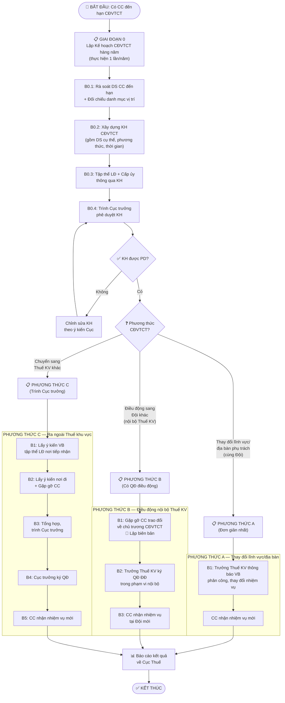

# QUY TRÌNH CHUYỂN ĐỔI VỊ TRÍ CÔNG TÁC ĐỊNH KỲ
## Áp dụng tại Thuế khu vực

| Thông tin | Nội dung |
|---|---|
| **Mã SOP** | SOP-CDVTCT-2026 |
| **Đơn vị áp dụng** | Thuế khu vực (Khu vực và tương đương) |
| **Đối tượng sử dụng SOP** | Phòng TCCB tại Thuế khu vực |
| **Loại SOP** | Hybrid (Decision Tree + Process + Checklist) |
| **Căn cứ pháp lý** | QĐ 439/QĐ-BTC ngày 10/3/2026 (Quy chế), QĐ 1528/QĐ-BTC ngày 28/4/2025 (Phân cấp), Nghị định 170/2025/NĐ-CP |
| **Phiên bản** | v1.0 — Ngày 30/03/2026 |

---

## MỤC ĐÍCH & PHẠM VI

### Mục đích
Hướng dẫn Phòng TCCB tại Thuế khu vực thực hiện đúng quy trình **chuyển đổi vị trí công tác định kỳ** (CĐVTCT) theo QĐ 439/QĐ-BTC — nhằm phòng ngừa tiêu cực, tham nhũng tại các vị trí nhạy cảm.

### Phạm vi áp dụng
- **ÁP DỤNG cho**: Chuyển đổi vị trí công tác **định kỳ, bắt buộc** đối với CC thuộc danh mục vị trí phải chuyển đổi theo quy định
- **KHÔNG ÁP DỤNG cho**:
  - Điều động CC theo yêu cầu CT hoặc nguyện vọng cá nhân (không theo danh mục) → Dùng **SOP-DD-CCKLĐ**
  - Điều động CC giữ chức vụ lãnh đạo → Quy trình ĐĐ CC giữ CV LĐ (QĐ 439, Đ.21 k.2 đ.2.1)
  - Luân chuyển cán bộ → Quy trình luân chuyển (QĐ 439, Đ.21 k.1)

### Khi nào kích hoạt quy trình này?
- **Trigger**: CC công tác tại một vị trí thuộc **danh mục phải định kỳ chuyển đổi** đã đạt thời hạn (3-5 năm) theo quy định

### Kết thúc khi
CC đã được bố trí sang vị trí công tác mới theo kế hoạch CĐVTCT.

---

## ⚠️ PHÂN BIỆT: ĐÂY LÀ QUY TRÌNH NÀO?

> **Nỗi đau thực tế**: Mọi người dễ **lẫn lộn** giữa CĐVTCT và Điều động. Bảng dưới đây giúp bạn xác định đúng:

| Tiêu chí | **Chuyển đổi VTCT** (SOP này) | **Điều động CC không giữ CV LĐ** (SOP khác) |
|---|---|---|
| **Bắt buộc?** | ✅ **CÓ** — phải làm khi hết hạn | ❌ Không — theo nhu cầu |
| **Có danh mục?** | ✅ **CÓ** — vị trí phải nằm trong danh mục | ❌ Bất kỳ vị trí nào |
| **Có kế hoạch?** | ✅ **CÓ** — phải lập KH trước, trình cấp TQ PD | ❌ Không bắt buộc KH |
| **Nguyên tắc hoán vị?** | ✅ **CÓ** — không tăng/giảm biên chế | ❌ Không bắt buộc |
| **Thời hạn?** | 3-5 năm tại vị trí | Không giới hạn |
| **Lý do** | Phòng ngừa tiêu cực, tham nhũng | Sắp xếp bố trí theo nhu cầu CT |
| **Ai quyết định? (nội bộ)** | Trưởng Thuế khu vực | Trưởng Thuế khu vực |
| **Ai quyết định? (ra ngoài)** | Cục trưởng Cục Thuế | Cục trưởng Cục Thuế |

**Ví dụ**:
- CC Trần Thị B đã làm **kiểm tra thuế** (vị trí thuộc danh mục) được 4 năm → ✅ **CĐVTCT bắt buộc** → Dùng SOP này
- CC Nguyễn Văn A viết đơn xin chuyển từ Đội KTT sang Đội QLN → ❌ Đây là ĐĐ theo nguyện vọng → Dùng SOP-DD-CCKLĐ

> 💡 **Mẹo nhớ**: CĐVTCT = **"đến hạn phải chuyển"**, Điều động = **"có lý do mới chuyển"**

---

## THUẬT NGỮ & VIẾT TẮT

| Viết tắt | Nghĩa | Ghi chú |
|---|---|---|
| CĐVTCT | Chuyển đổi vị trí công tác | Định kỳ, bắt buộc |
| CC | Công chức | |
| Thuế KV | Thuế khu vực | = "Khu vực và tương đương" theo QĐ 1528 |
| Trưởng Thuế KV | Trưởng Thuế khu vực | = "Trưởng khu vực và tương đương" theo QĐ 1528 |
| Đội | Phòng, đội, đơn vị cấp cơ sở (Thuế cơ sở) thuộc Thuế khu vực | = "Đội và tương đương" |
| Phòng TCCB | Phòng Tổ chức cán bộ tại Thuế khu vực | Là đơn vị tham mưu về công tác TCCB |
| KH | Kế hoạch | |
| PD | Phê duyệt | |
| CT | Công tác | |
| TQ | Thẩm quyền | |

---

## PHÂN CẤP THẨM QUYỀN

| Nội dung | Ai phê duyệt? | Ai quyết định? | Căn cứ |
|---|---|---|---|
| **Phê duyệt KH CĐVTCT** | Cục trưởng Cục Thuế | — | QĐ 439, Đ.21 k.3 đ.3.1b |
| **CĐVTCT nội bộ — thay đổi lĩnh vực/địa bàn** | — | Trưởng Thuế khu vực (VB phân công) | QĐ 439, Đ.21 k.3 đ.3.2a |
| **CĐVTCT nội bộ — theo phương thức ĐĐ** | — | Trưởng Thuế khu vực (QĐ ĐĐ) | QĐ 439, Đ.21 k.3 đ.3.2b |
| **CĐVTCT ra ngoài (giữa các Thuế KV)** | Cục trưởng | Cục trưởng | QĐ 1528, Đ.6 k.2.3 |

> **💡 TẠI SAO có 3 phương thức CĐVTCT?**
> 
> QĐ 439 Đ.21 k.3 đ.3.2 phân biệt rõ:
> - **(a) Thay đổi lĩnh vực/địa bàn**: CC vẫn ở cùng Đội nhưng thay đổi phạm vi phụ trách (VD: từ theo dõi địa bàn quận A sang quận B). Chỉ cần **VB phân công**, KHÔNG cần QĐ điều động.
> - **(b) Theo phương thức điều động**: CC chuyển sang Đội khác trong Thuế khu vực. Cần **QĐ điều động** chính thức.
> - **(c) Ra ngoài đơn vị**: CC chuyển sang Thuế khu vực khác. Quy trình như ĐĐ CC (có lấy ý kiến nơi đi, nơi đến).

---

## SƠ ĐỒ QUY TRÌNH

---

## QUY TRÌNH CHI TIẾT

### ⬛ GIAI ĐOẠN 0: LẬP KẾ HOẠCH CĐVTCT HÀNG NĂM

> 💡 **TẠI SAO phải lập KH trước?** Vì QĐ 439, Đ.19 k.3 quy định CĐVTCT "phải dựa trên cơ sở kế hoạch, phương án đã được cấp có thẩm quyền phê duyệt". Không có KH = không được thực hiện CĐVTCT.

#### Bước 0.1: Rà soát danh sách CC đến hạn

| Mục | Nội dung |
|---|---|
| **👤 Ai thực hiện** | Phòng TCCB |
| **⚡ Làm gì** | Rà soát toàn bộ CC tại Thuế khu vực → lọc ra những CC: (1) đang công tác tại vị trí thuộc **danh mục phải CĐVTCT** VÀ (2) đã đạt **thời hạn 3-5 năm** tại vị trí đó |
| **💡 Tại sao** | Đây là bước nền tảng. Bỏ sót CC nào = vi phạm quy định về CĐVTCT |
| **📥 Đầu vào** | Danh mục vị trí phải CĐVTCT (theo quy định của Cục Thuế / Tổng cục Thuế / Nghị định 170); Hồ sơ CC tại Thuế khu vực |
| **📤 Sản phẩm** | **Danh sách CC đến hạn CĐVTCT** (kèm thông tin: vị trí hiện tại, thời gian đã công tác, dự kiến vị trí mới) |
| **🎯 Tiêu chí done** | 100% CC thuộc danh mục đã được rà soát |

> ⚠️ **Kiểm tra loại trừ**: Loại ra khỏi danh sách những CC thuộc trường hợp **KHÔNG thực hiện CĐVTCT** (xem Checklist bên dưới).

#### ✅ Checklist kiểm tra loại trừ

| # | Trường hợp KHÔNG/CHƯA thực hiện CĐVTCT | Căn cứ | ✓ |
|---|---|---|---|
| 1 | CC có thời gian công tác còn lại **dưới 18 tháng** đến tuổi nghỉ hưu | QĐ 439, Đ.19 k.6 | ☐ |
| 2 | CC đang điều trị bệnh hiểm nghèo / không đảm bảo sức khỏe | QĐ 439, Đ.20 k.5.1 | ☐ |
| 3 | CC đang bị xem xét kỷ luật / điều tra / liên quan thanh tra, kiểm tra | QĐ 439, Đ.20 k.5.2 | ☐ |
| 4 | CC đang đi học tập dài hạn (≥12 tháng) hoặc đang biệt phái | QĐ 439, Đ.20 k.5.2 | ☐ |
| 5 | CC nữ đang mang thai, nghỉ thai sản, nuôi con dưới 36 tháng | QĐ 439, Đ.20 k.5.3 | ☐ |
| 6 | CC là người tố cáo đang được bảo vệ | QĐ 439, Đ.20 k.5.4 | ☐ |
| 7 | ĐĐ trái chuyên môn, nghiệp vụ CC đang làm | QĐ 439, Đ.19 k.6 | ☐ |

> ⚠️ **Trường hợp đặc biệt**: Nếu Thuế khu vực chỉ có **1 vị trí** trong danh mục CĐVTCT mà yêu cầu chuyên môn khác với các vị trí còn lại → **Cục trưởng** (cấp trên trực tiếp) lập KH chuyển đổi chung (QĐ 439, Đ.19 k.6).

#### Bước 0.2: Xây dựng Kế hoạch CĐVTCT

| Mục | Nội dung |
|---|---|
| **👤 Ai thực hiện** | Phòng TCCB |
| **⚡ Làm gì** | Xây dựng KH CĐVTCT gồm: mục đích, yêu cầu; trường hợp cụ thể phải CĐVTCT; **phương thức** chuyển đổi cho từng trường hợp; thời gian thực hiện; quyền, nghĩa vụ CC; biện pháp tổ chức thực hiện |
| **💡 Tại sao** | QĐ 439 Đ.21 k.3 đ.3.1c quy định rõ nội dung KH phải có. KH thiếu nội dung = bị trả lại |
| **📥 Đầu vào** | DS CC đến hạn (Bước 0.1) |
| **📤 Sản phẩm** | **Dự thảo KH CĐVTCT** |

> ⚠️ **Nguyên tắc hoán vị** (QĐ 439, Đ.19 k.4): CĐVTCT phải thực hiện đúng nguyên tắc hoán vị, **KHÔNG làm ảnh hưởng đến tăng, giảm biên chế** của đơn vị. Khi xây dựng KH, phải đảm bảo mỗi CC chuyển đi đều có CC khác thay thế.

#### Bước 0.3: Tập thể LĐ và Cấp ủy thông qua KH

| Mục | Nội dung |
|---|---|
| **👤 Ai thực hiện** | Tập thể lãnh đạo Thuế khu vực + Cấp ủy |
| **⚡ Làm gì** | Họp thảo luận, thông qua KH CĐVTCT. Đối với CC giữ CV LĐ → cấp ủy cũng phải thông qua |
| **💡 Tại sao** | QĐ 439 Đ.21 k.3 đ.3.1a: "tập thể lãnh đạo đơn vị thống nhất danh sách... tập thể lãnh đạo và cấp ủy đơn vị thông qua kế hoạch" |
| **📤 Sản phẩm** | **Biên bản họp** + **KH CĐVTCT đã được thông qua** |
| **🎯 Tiêu chí done** | KH đã có chữ ký đầy đủ, sẵn sàng trình Cục |

#### Bước 0.4: Trình Cục trưởng phê duyệt KH

| Mục | Nội dung |
|---|---|
| **👤 Ai thực hiện** | Phòng TCCB Thuế khu vực (qua Phòng TCCB Cục Thuế) |
| **⚡ Làm gì** | Gửi KH CĐVTCT kèm Tờ trình trình Cục trưởng phê duyệt |
| **💡 Tại sao** | QĐ 439 Đ.21 k.3 đ.3.1b: Cấp phê duyệt KH CĐVTCT = cấp có thẩm quyền phê duyệt chủ trương ĐĐ = **Cục trưởng** (đối với CC thuộc Thuế khu vực) |
| **📥 Đầu vào** | KH CĐVTCT + Biên bản họp |
| **📤 Sản phẩm** | **KH CĐVTCT được Cục trưởng phê duyệt** |
| **🎯 Tiêu chí done** | KH có bút phê / văn bản PD của Cục trưởng |

> ⚠️ **KHÔNG được thực hiện CĐVTCT khi chưa có KH được phê duyệt!**

---

### 📋 PHƯƠNG THỨC A — THAY ĐỔI LĨNH VỰC/ĐỊA BÀN (đơn giản nhất)

> Áp dụng khi CC vẫn ở **cùng Đội** nhưng thay đổi **phạm vi lĩnh vực hoặc địa bàn** phụ trách, theo dõi.
> VD: CC theo dõi thuế địa bàn quận A → chuyển sang theo dõi địa bàn quận B (vẫn thuộc cùng Đội Kiểm tra thuế).

#### Bước A1: Trưởng Thuế khu vực thông báo bằng văn bản

| Mục | Nội dung |
|---|---|
| **👤 Ai thực hiện** | Trưởng Thuế khu vực (Trưởng khu vực và tương đương) |
| **⚡ Làm gì** | Ban hành **văn bản phân công, thay đổi thực hiện nhiệm vụ** đối với CC → thông báo cho CC và các bộ phận liên quan |
| **💡 Tại sao** | QĐ 439 Đ.21 k.3 đ.3.2a: "Do người đứng đầu đơn vị sử dụng hoặc người được giao thẩm quyền sử dụng thông báo bằng văn bản việc phân công, thay đổi thực hiện nhiệm vụ đối với công chức, viên chức" |
| **📥 Đầu vào** | KH CĐVTCT đã được PD |
| **📤 Sản phẩm** | **Văn bản phân công/thay đổi nhiệm vụ** |
| **🎯 Tiêu chí done** | VB đã ban hành, CC đã nhận thông báo |

> 💡 **Đây là phương thức đơn giản nhất** — không cần QĐ điều động, không cần lấy ý kiến, không cần gặp gỡ CC. Chỉ cần VB phân công.

---

### 📋 PHƯƠNG THỨC B — ĐIỀU ĐỘNG SANG ĐỘI KHÁC (nội bộ Thuế khu vực)

> Áp dụng khi CC phải chuyển sang **Đội khác** trong cùng Thuế khu vực.
> VD: CC từ Đội Kiểm tra thuế số 1 → chuyển sang Đội Quản lý nợ.

#### Bước B1: Gặp gỡ, trao đổi với CC

| Mục | Nội dung |
|---|---|
| **👤 Ai thực hiện** | Lãnh đạo Thuế khu vực hoặc Phòng TCCB |
| **⚡ Làm gì** | Gặp CC để trao đổi về chủ trương CĐVTCT theo KH đã được PD và yêu cầu nhiệm vụ tại vị trí mới |
| **💡 Tại sao** | QĐ 439 Đ.21 k.3 đ.3.2b - Bước 1: "Lãnh đạo đơn vị gặp gỡ, trao đổi với công chức, viên chức về chủ trương chuyển đổi vị trí công tác theo kế hoạch và yêu cầu nhiệm vụ" |
| **📥 Đầu vào** | KH CĐVTCT đã PD |
| **📤 Sản phẩm** | **Biên bản gặp gỡ CC** (có chữ ký đôi bên) |
| **🎯 Tiêu chí done** | Biên bản đã lập, CC đã được thông báo |

#### Bước B2: Trưởng Thuế khu vực ký QĐ điều động

| Mục | Nội dung |
|---|---|
| **👤 Ai thực hiện** | Trưởng Thuế khu vực |
| **⚡ Làm gì** | Ký QĐ điều động CC từ Đội cũ sang Đội mới (bằng văn bản) |
| **💡 Tại sao** | QĐ 439 Đ.21 k.3 đ.3.2b - Bước 2: "Người đứng đầu đơn vị quyết định (bằng văn bản) về việc điều động công chức, viên chức trong phạm vi nội bộ đơn vị" |
| **📥 Đầu vào** | Biên bản gặp gỡ CC (Bước B1) |
| **📤 Sản phẩm** | **Quyết định điều động** |
| **🎯 Tiêu chí done** | QĐ có chữ ký Trưởng Thuế khu vực, đóng dấu |

> 📌 Thuế khu vực có trách nhiệm **gửi báo cáo kết quả** thực hiện KH CĐVTCT về Cục Thuế (cơ quan quản lý cấp trên) để theo dõi (QĐ 439, Đ.21 k.3 đ.3.2b).

#### Bước B3: CC nhận nhiệm vụ tại Đội mới

| Mục | Nội dung |
|---|---|
| **👤 Ai thực hiện** | CC + Đội trưởng cũ + Đội trưởng mới |
| **⚡ Làm gì** | CC bàn giao công việc ở Đội cũ, nhận nhiệm vụ tại Đội mới |
| **📤 Sản phẩm** | Biên bản bàn giao (nếu cần) |
| **🎯 Tiêu chí done** | CC bắt đầu làm việc tại vị trí mới |

---

### 📋 PHƯƠNG THỨC C — CĐVTCT RA NGOÀI THUẾ KHU VỰC

> Áp dụng khi CC phải chuyển sang **Thuế khu vực khác** trong cùng Cục Thuế.
> VD: CC từ Thuế khu vực A → chuyển sang Thuế khu vực B.
> **Quy trình tương tự điều động CC ra ngoài đơn vị** (QĐ 439, Đ.21 k.3 đ.3.2c).

#### Bước C1: Lấy ý kiến tập thể LĐ nơi tiếp nhận

| Mục | Nội dung |
|---|---|
| **👤 Ai thực hiện** | Phòng TCCB Cục Thuế hoặc Phòng TCCB Thuế khu vực |
| **⚡ Làm gì** | Gửi VB lấy ý kiến tập thể lãnh đạo **Thuế khu vực nơi tiếp nhận** về chủ trương tiếp nhận CC |
| **💡 Tại sao** | Tương tự quy trình ĐĐ CC (QĐ 439, Đ.21 k.2 đ.2.1a) — phải có sự đồng thuận nơi đến |
| **📥 Đầu vào** | KH CĐVTCT đã PD |
| **📤 Sản phẩm** | **VB trả lời** của tập thể LĐ nơi tiếp nhận |

#### Bước C2: Lấy ý kiến nơi đi + Gặp gỡ CC

| Mục | Nội dung |
|---|---|
| **👤 Ai thực hiện** | Phòng TCCB Cục Thuế |
| **⚡ Làm gì** | (1) Lấy ý kiến VB của tập thể LĐ Thuế KV nơi đi. (2) Gặp CC trao đổi về chủ trương CĐVTCT. Lập biên bản. |
| **📥 Đầu vào** | VB trả lời nơi tiếp nhận (Bước C1) |
| **📤 Sản phẩm** | VB ý kiến nơi đi + **Biên bản gặp gỡ CC** |

#### Bước C3: Tổng hợp trình Cục trưởng

| Mục | Nội dung |
|---|---|
| **👤 Ai thực hiện** | Phòng TCCB Cục Thuế |
| **⚡ Làm gì** | Tổng hợp toàn bộ kết quả, lập Tờ trình trình Cục trưởng quyết định |
| **📤 Sản phẩm** | **Tờ trình** kèm hồ sơ |

#### Bước C4: Cục trưởng quyết định

| Mục | Nội dung |
|---|---|
| **👤 Ai thực hiện** | Cục trưởng Cục Thuế |
| **⚡ Làm gì** | Xem xét hồ sơ, ký QĐ điều động CC |
| **📤 Sản phẩm** | **Quyết định điều động** |

#### Bước C5: CC nhận nhiệm vụ tại Thuế khu vực mới

| Mục | Nội dung |
|---|---|
| **⚡ Làm gì** | Gửi QĐ cho CC, Thuế KV nơi đi và nơi đến. CC bàn giao công việc, nhận nhiệm vụ mới |
| **📤 Sản phẩm** | Biên bản bàn giao + CC nhận nhiệm vụ mới |

---

## XỬ LÝ NGOẠI LỆ (Edge Cases)

### Tình huống 1: CC từ chối CĐVTCT
- **IF**: CC không chấp hành quyết định CĐVTCT
- **THEN**: Xem xét kỷ luật từ hình thức **khiển trách trở lên**; không được xem xét bổ nhiệm, nâng lương trước hạn (QĐ 439, Đ.19 k.5.1)
- **ESCALATION**: Báo cáo Trưởng Thuế khu vực → Cục trưởng

### Tình huống 2: Thuế khu vực chỉ có 1 vị trí trong danh mục
- **IF**: Thuế KV chỉ có 1 vị trí thuộc danh mục CĐVTCT mà yêu cầu chuyên môn khác với các vị trí còn lại
- **THEN**: Không tự xử lý ở cấp Thuế khu vực
- **ESCALATION**: **Cục trưởng** (cấp trên trực tiếp) lập KH chuyển đổi chung (QĐ 439, Đ.19 k.6)

### Tình huống 3: CC không thể CĐVTCT vì bất khả kháng
- **IF**: CC có lý do bệnh nặng đột xuất, gia đình có biến cố...
- **THEN**: CC báo cáo bằng VB. Cấp TQ xem xét tạm hoãn
- **ESCALATION**: Cục trưởng quyết định (QĐ 439, Đ.19 k.5.2)

### Tình huống 4: Không đủ CC để hoán vị
- **IF**: Không tìm được CC phù hợp để hoán vị (VD: vị trí đòi hỏi chuyên môn đặc thù)
- **THEN**: Báo cáo Cục Thuế đề nghị hỗ trợ bố trí từ Thuế khu vực khác
- **ESCALATION**: Cục trưởng lập KH chung giữa các Thuế khu vực

---

## LƯU Ý QUAN TRỌNG

| # | Lưu ý | Chi tiết |
|---|---|---|
| 1 | ⚠️ **PHẢI CÓ KH trước** | Không có KH được PD = không được thực hiện CĐVTCT |
| 2 | ⚠️ **Nguyên tắc hoán vị** | Không làm tăng/giảm biên chế đơn vị (QĐ 439, Đ.19 k.4) |
| 3 | ⚠️ **KHÔNG ĐĐ trái chuyên môn** | QĐ 439, Đ.19 k.6 |
| 4 | ⚠️ **Công bố công khai** | KH CĐVTCT phải được công bố công khai trong đơn vị (QĐ 439, Đ.19 k.4) |
| 5 | ⚠️ **Nghiêm cấm lợi dụng** | Nghiêm cấm lợi dụng CĐVTCT để trù dập CC (QĐ 439, Đ.19 k.7) |
| 6 | 📌 **Thời hạn CĐVTCT** | 2-5 năm tại vị trí mới (QĐ 439, Đ.23 k.2). Sau hết hạn → lại phải CĐVTCT tiếp |
| 7 | 📌 **CC dưới 18 tháng đến hưu** | Không thực hiện CĐVTCT (QĐ 439, Đ.19 k.6) |
| 8 | 📌 **Phân biệt với Điều động** | Nếu chuyển CC **không** theo danh mục/thời hạn → dùng SOP-DD-CCKLĐ |

---

## CHECKLIST HỒ SƠ

### Phương thức A — Thay đổi lĩnh vực/địa bàn

| STT | Loại giấy tờ | ✓ |
|---|---|---|
| 1 | KH CĐVTCT đã được Cục trưởng phê duyệt | ☐ |
| 2 | Văn bản phân công/thay đổi nhiệm vụ (do Trưởng Thuế khu vực ký) | ☐ |

### Phương thức B — Điều động nội bộ Thuế khu vực

| STT | Loại giấy tờ | ✓ |
|---|---|---|
| 1 | KH CĐVTCT đã được Cục trưởng phê duyệt | ☐ |
| 2 | Biên bản gặp gỡ CC | ☐ |
| 3 | Quyết định điều động (do Trưởng Thuế khu vực ký) | ☐ |
| 4 | Báo cáo kết quả gửi Cục Thuế | ☐ |

### Phương thức C — CĐVTCT ra ngoài Thuế khu vực

| STT | Loại giấy tờ | ✓ |
|---|---|---|
| 1 | KH CĐVTCT đã được Cục trưởng phê duyệt | ☐ |
| 2 | VB lấy ý kiến + trả lời của LĐ nơi tiếp nhận | ☐ |
| 3 | VB lấy ý kiến + trả lời của LĐ nơi đi | ☐ |
| 4 | Đánh giá, nhận xét CC (03 năm gần nhất) | ☐ |
| 5 | Biên bản gặp gỡ CC | ☐ |
| 6 | Tờ trình trình Cục trưởng | ☐ |
| 7 | Quyết định điều động (do Cục trưởng ký) | ☐ |

---

## CHỈ SỐ ĐO LƯỜNG (KPIs)

| Chỉ số | Mục tiêu | Cách đo | Tần suất |
|---|---|---|---|
| KH CĐVTCT được PD đúng hạn | Trước khi hết hạn CC đầu tiên | Ngày PD vs ngày cần thực hiện | Hàng năm |
| Tỷ lệ CC được CĐVTCT đúng hạn | 100% | CC đã CĐVTCT / CC đến hạn | Hàng năm |
| Tỷ lệ CC từ chối | 0% | Số CC không chấp hành / tổng | Hàng năm |
| Nguyên tắc hoán vị được đảm bảo | 100% | Biên chế trước = sau CĐVTCT | Mỗi đợt |
| Tỷ lệ hồ sơ bị trả lại (Cục) | 0% | Số lần Cục yêu cầu bổ sung / tổng | Hàng năm |

---

## CÔNG CỤ & TÀI LIỆU LIÊN QUAN

| Tài liệu | Vị trí/Số hiệu |
|---|---|
| Quy chế bổ nhiệm, điều động... | QĐ 439/QĐ-BTC ngày 10/3/2026 — Chương IV (Đ.19-26) |
| Phân cấp quản lý CC, VC | QĐ 1528/QĐ-BTC ngày 28/4/2025 — Đ.6, Đ.10 |
| Danh mục vị trí phải CĐVTCT | Theo quy định của Cục Thuế / Tổng cục Thuế / Nghị định 170/2025/NĐ-CP |
| **SOP Điều động CC không giữ CV LĐ** (liên quan) | SOP-DD-CCKLĐ-2026 |

---

## LỊCH SỬ THAY ĐỔI

| Phiên bản | Ngày | Nội dung thay đổi |
|---|---|---|
| v1.0 | 30/03/2026 | Xây dựng SOP ban đầu |
