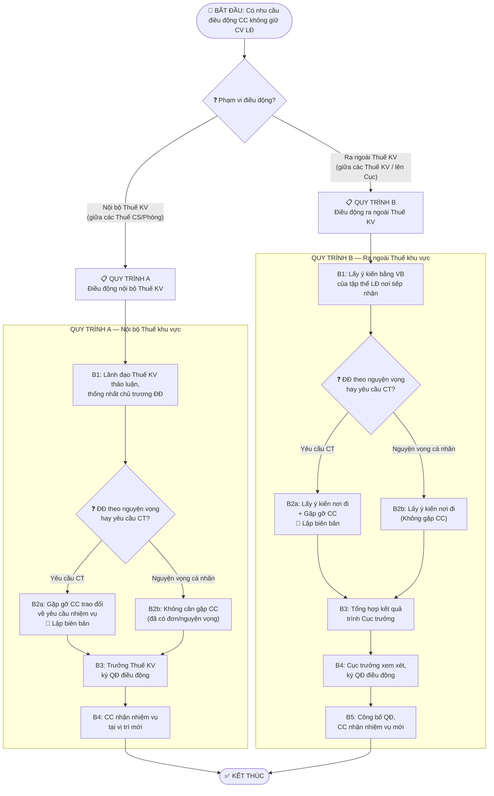

# QUY TRÌNH ĐIỀU ĐỘNG CÔNG CHỨC KHÔNG GIỮ CHỨC VỤ LÃNH ĐẠO, QUẢN LÝ
## Áp dụng tại Thuế khu vực

| Thông tin | Nội dung |
|---|---|
| **Mã SOP** | SOP-DD-CCKLĐ-2026 |
| **Đơn vị áp dụng** | Thuế khu vực (Khu vực và tương đương) |
| **Đối tượng sử dụng SOP** | Phòng TCCB tại Thuế khu vực |
| **Loại SOP** | Process (tuần tự, có nhánh rẽ theo phạm vi) |
| **Căn cứ pháp lý** | QĐ 439/QĐ-BTC ngày 10/3/2026 (Quy chế), QĐ 1528/QĐ-BTC ngày 28/4/2025 (Phân cấp) |
| **Phiên bản** | v1.0 — Ngày 30/03/2026 |

---

## MỤC ĐÍCH & PHẠM VI

### Mục đích
Hướng dẫn Phòng TCCB tại Thuế khu vực thực hiện đúng quy trình **điều động công chức không giữ chức vụ lãnh đạo, quản lý** theo QĐ 439/QĐ-BTC.

### Phạm vi áp dụng
- **ÁP DỤNG cho**: Điều động (chuyển vị trí công tác) đối với công chức **không** giữ chức vụ lãnh đạo, quản lý tại Thuế khu vực
- **KHÔNG ÁP DỤNG cho**:
  - Điều động CC **giữ chức vụ lãnh đạo** (Trưởng Thuế cơ sở trở lên) → Dùng quy trình điều động CC giữ CV LĐ (QĐ 439, Đ.21 k.2 đ.2.1)
  - Chuyển đổi vị trí công tác định kỳ (bắt buộc) → Dùng **SOP-CDVTCT** riêng
  - Luân chuyển cán bộ → Quy trình luân chuyển (QĐ 439, Đ.21 k.1)
  - Biệt phái → Quy trình biệt phái (QĐ 439, Đ.22)

### Khi nào kích hoạt quy trình này?
- **Trigger 1**: Thuế khu vực có nhu cầu sắp xếp, bố trí lại CC để đáp ứng yêu cầu nhiệm vụ (VD: tăng cường nhân lực cho bộ phận kiểm tra thuế)
- **Trigger 2**: CC có đơn/nguyện vọng cá nhân xin chuyển vị trí công tác (VD: CC xin chuyển từ Thuế cơ sở này sang Thuế cơ sở khác vì phù hợp chuyên môn)
- **Trigger 3**: Cục Thuế có chủ trương điều động CC giữa các Thuế khu vực

### Kết thúc khi
Quyết định điều động có hiệu lực và CC nhận nhiệm vụ tại vị trí mới.

---

## ⚠️ PHÂN BIỆT: ĐÂY LÀ QUY TRÌNH NÀO?

> **Nỗi đau thực tế**: Mọi người dễ **lẫn lộn** giữa Điều động và Chuyển đổi VTCT. Trước khi bắt đầu, hãy xác định đúng quy trình:

| Câu hỏi | Nếu CÓ → | Nếu KHÔNG → |
|---|---|---|
| CC có nằm trong **danh mục vị trí phải chuyển đổi** và **đã đến hạn** (3-5 năm)? | → Dùng **SOP Chuyển đổi VTCT** | Tiếp tục ↓ |
| Việc thay đổi vị trí là do **yêu cầu công tác** hoặc **nguyện vọng cá nhân**? | → ✅ Đúng SOP này | Kiểm tra lại |

**Ví dụ**:
- CC Nguyễn Văn A (Thuế cơ sở X, phụ trách kiểm tra thuế) làm đơn xin chuyển sang Thuế cơ sở Y (phụ trách quản lý nợ) vì muốn phát triển chuyên môn → **Điều động theo nguyện vọng** → ✅ SOP này
- CC Trần Thị B (vị trí kiểm tra thuế tại Thuế cơ sở X) đã công tác 4 năm tại vị trí này, thuộc danh mục phải chuyển đổi → **CĐVTCT bắt buộc** → ❌ Dùng SOP-CDVTCT

---

## THUẬT NGỮ & VIẾT TẮT

| Viết tắt | Nghĩa | Ghi chú |
|---|---|---|
| CC | Công chức | |
| CV LĐ | Chức vụ lãnh đạo, quản lý | |
| Thuế KV | Thuế khu vực | = "Khu vực và tương đương" theo QĐ 1528; tên cũ: Chi cục Thuế khu vực |
| Trưởng Thuế KV | Trưởng Thuế khu vực | = "Trưởng khu vực và tương đương" theo QĐ 1528 |
| Thuế cơ sở | Đơn vị cấp cơ sở trực thuộc Thuế khu vực | Tên cũ: Đội Thuế cấp huyện. Có tư cách pháp nhân, con dấu riêng |
| Trưởng Thuế CS | Trưởng Thuế cơ sở | Tên cũ: Đội trưởng Đội thuế cấp huyện |
| Phòng TCCB | Phòng Tổ chức cán bộ tại Thuế khu vực | Là đơn vị tham mưu về công tác TCCB (QĐ 439 Đ.2 k.12) |
| CĐVTCT | Chuyển đổi vị trí công tác | |
| ĐĐ | Điều động | |
| CT | Công tác | |
| TQ | Thẩm quyền | |

---

## PHÂN CẤP THẨM QUYỀN

| Phạm vi điều động | Ai phê duyệt chủ trương? | Ai ký QĐ? | Căn cứ |
|---|---|---|---|
| **Nội bộ Thuế khu vực** (giữa các Thuế cơ sở / Phòng trong cùng 1 Thuế KV) | Trưởng Thuế khu vực | Trưởng Thuế khu vực | QĐ 439 Đ.2 k.4 |
| **Giữa các Thuế khu vực** (từ Thuế KV này sang Thuế KV khác trong cùng Cục Thuế) | Cục trưởng Cục Thuế | Cục trưởng Cục Thuế | QĐ 1528 Đ.6 k.2.3 |
| **Từ Thuế khu vực lên/về cơ quan Cục** | Cục trưởng Cục Thuế | Cục trưởng Cục Thuế | QĐ 1528 Đ.6 k.2.3 |

> **💡 TẠI SAO phân cấp như vậy?** Vì theo QĐ 439 Đ.2 k.4, "Điều động CC không giữ CV LĐ" là quyết định của **cấp có thẩm quyền** về việc bố trí CC trong phạm vi nội bộ đơn vị hoặc từ đơn vị này sang đơn vị khác. Điều động nội bộ Thuế KV = Trưởng Thuế KV tự quyết. Điều động giữa các Thuế KV = Cục trưởng quyết (vì CC rời phạm vi quản lý của Trưởng Thuế KV).

---

## SƠ ĐỒ QUY TRÌNH

---

## QUY TRÌNH CHI TIẾT

### ⬛ BƯỚC 0: XÁC ĐỊNH PHẠM VI — Nội bộ hay ra ngoài Thuế khu vực?

| Mục | Nội dung |
|---|---|
| **👤 Ai thực hiện** | Phòng TCCB |
| **⚡ Làm gì** | Xác định CC dự kiến điều động sẽ chuyển đi đâu: (1) trong nội bộ Thuế KV hay (2) ra ngoài Thuế KV |
| **💡 Tại sao** | Vì **thẩm quyền quyết định** và **quy trình** khác nhau hoàn toàn. Nội bộ = Trưởng Thuế KV tự quyết, quy trình ngắn. Ra ngoài = phải trình Cục trưởng, quy trình dài hơn. |
| **📥 Đầu vào** | Nhu cầu sắp xếp CC hoặc đơn/nguyện vọng của CC |
| **📤 Sản phẩm** | Xác định rõ: áp dụng Quy trình A hay Quy trình B |
| **🎯 Tiêu chí done** | Đã xác định phạm vi, đã kiểm tra CC không thuộc trường hợp chưa được điều động (xem mục "Kiểm tra tiền đề" bên dưới) |

#### ✅ Checklist kiểm tra tiền đề (BẮT BUỘC trước khi thực hiện)

Trước khi bắt đầu quy trình, kiểm tra CC **KHÔNG** thuộc các trường hợp sau (QĐ 439, Đ.20 k.5):

| # | Trường hợp CHƯA được điều động | Kiểm tra | Trừ trường hợp |
|---|---|---|---|
| 1 | CC đang điều trị bệnh hiểm nghèo / không đảm bảo sức khỏe | ☐ | — |
| 2 | CC đang bị xem xét kỷ luật / điều tra / truy tố / xét xử / liên quan thanh tra, kiểm tra | ☐ | — |
| 3 | CC đang đi học tập dài hạn (≥12 tháng) hoặc đang biệt phái | ☐ | — |
| 4 | CC nữ đang mang thai, nghỉ thai sản, nuôi con dưới 36 tháng tuổi | ☐ | Có nguyện vọng được ĐĐ |
| 5 | CC nam đang nuôi con dưới 36 tháng tuổi (vợ mất hoặc bất khả kháng) | ☐ | Có nguyện vọng được ĐĐ |
| 6 | CC có hoàn cảnh đặc biệt khó khăn (được NĐĐ xác nhận) | ☐ | Có nguyện vọng được ĐĐ |
| 7 | CC là người tố cáo đang được bảo vệ | ☐ | Có yêu cầu của CQ giải quyết tố cáo hoặc nguyện vọng |

> ⚠️ **Nếu CC thuộc bất kỳ trường hợp nào trên** → DỪNG quy trình, báo cáo Lãnh đạo Thuế khu vực.

---

### 📋 QUY TRÌNH A — ĐIỀU ĐỘNG NỘI BỘ THUẾ KHU VỰC

> Áp dụng khi CC chuyển từ Thuế cơ sở / Phòng này sang Thuế cơ sở / Phòng khác **trong cùng** Thuế khu vực.

#### Bước A1: Lãnh đạo Thuế khu vực thảo luận, thống nhất chủ trương

| Mục | Nội dung |
|---|---|
| **👤 Ai thực hiện** | Tập thể lãnh đạo Thuế khu vực |
| **⚡ Làm gì** | Họp thảo luận, thống nhất chủ trương điều động CC. Xem xét: vị trí cần bố trí, CC phù hợp, lý do ĐĐ |
| **💡 Tại sao** | Vì QĐ 439 Đ.21 k.2 yêu cầu tập thể lãnh đạo và cấp ủy thảo luận, thống nhất chủ trương trước khi thực hiện |
| **⏰ Khi nào** | Khi phát sinh nhu cầu sắp xếp CC hoặc khi có đơn nguyện vọng của CC |
| **📥 Đầu vào** | Nhu cầu sắp xếp / Đơn nguyện vọng CC / Ý kiến Trưởng Thuế cơ sở |
| **📤 Sản phẩm** | Biên bản họp ghi nhận ý kiến thống nhất |
| **🎯 Tiêu chí done** | Tập thể LĐ đã thống nhất bằng văn bản |

#### Bước A2: Gặp gỡ, trao đổi với CC (nếu theo yêu cầu công tác)

| Mục | Nội dung |
|---|---|
| **👤 Ai thực hiện** | Lãnh đạo Thuế khu vực hoặc Phòng TCCB |
| **⚡ Làm gì** | Gặp CC để trao đổi về chủ trương điều động và yêu cầu nhiệm vụ |
| **💡 Tại sao** | Để CC nắm rõ lý do và sẵn sàng nhận nhiệm vụ mới. QĐ 439 Đ.21 k.2 đ.2.1b yêu cầu gặp gỡ và lập biên bản |
| **📥 Đầu vào** | Chủ trương đã thống nhất ở Bước A1 |
| **📤 Sản phẩm** | **Biên bản gặp gỡ, trao đổi** (có chữ ký CC) |
| **🎯 Tiêu chí done** | Biên bản đã được lập, CC đã được thông báo |

> ⚠️ **NGOẠI LỆ**: Nếu điều động **theo nguyện vọng cá nhân** → **KHÔNG CẦN** thực hiện thủ tục gặp gỡ, trao đổi (QĐ 439, Đ.21 k.2 đ.2.2: "Đối với trường hợp điều động theo nguyện vọng của cá nhân không cần thực hiện thủ tục gặp gỡ, trao đổi với cá nhân"). Chuyển ngay sang Bước A3.

#### Bước A3: Trưởng Thuế khu vực ký QĐ điều động

| Mục | Nội dung |
|---|---|
| **👤 Ai thực hiện** | Trưởng Thuế khu vực (Trưởng khu vực và tương đương) |
| **⚡ Làm gì** | Ký quyết định điều động CC về vị trí mới (Thuế cơ sở / Phòng mới) |
| **💡 Tại sao** | Trưởng Thuế khu vực có thẩm quyền điều động, chuyển đổi VTCT đối với Trưởng Thuế cơ sở và tương đương trở xuống trong phạm vi nội bộ (QĐ 1528, Đ.10 k.2.1) |
| **📥 Đầu vào** | Biên bản họp LĐ + Biên bản gặp gỡ CC (nếu có) |
| **📤 Sản phẩm** | **Quyết định điều động** (bằng văn bản) |
| **🎯 Tiêu chí done** | QĐ có chữ ký Trưởng Thuế khu vực, đóng dấu |

#### Bước A4: CC nhận nhiệm vụ tại vị trí mới

| Mục | Nội dung |
|---|---|
| **👤 Ai thực hiện** | Phòng TCCB + CC được điều động + Thuế cơ sở / Phòng nhận |
| **⚡ Làm gì** | Thông báo QĐ cho CC, bàn giao công việc ở đơn vị cũ, nhận nhiệm vụ ở đơn vị mới |
| **📤 Sản phẩm** | Biên bản bàn giao (nếu cần) |
| **🎯 Tiêu chí done** | CC đã có mặt và bắt đầu làm việc tại vị trí mới |

---

### 📋 QUY TRÌNH B — ĐIỀU ĐỘNG RA NGOÀI THUẾ KHU VỰC

> Áp dụng khi CC chuyển từ Thuế khu vực này sang Thuế khu vực khác hoặc về/lên cơ quan Cục Thuế.
> Thẩm quyền: **Cục trưởng Cục Thuế** quyết định.

#### Bước B1: Lấy ý kiến tập thể lãnh đạo nơi tiếp nhận

| Mục | Nội dung |
|---|---|
| **👤 Ai thực hiện** | Phòng TCCB (Thuế KV nơi đi) hoặc Phòng TCCB Cục Thuế |
| **⚡ Làm gì** | Gửi văn bản lấy ý kiến của tập thể lãnh đạo **nơi tiếp nhận** (Thuế KV nơi đến hoặc cơ quan Cục) về chủ trương tiếp nhận CC |
| **💡 Tại sao** | QĐ 439 Đ.21 k.2 đ.2.1a yêu cầu phải lấy ý kiến nơi tiếp nhận trước. Đây là bước **bắt buộc** để đảm bảo nơi đến đồng ý và có vị trí bố trí. |
| **⏰ Khi nào** | Sau khi có chủ trương ĐĐ từ cấp TQ hoặc từ đề xuất của Thuế KV |
| **📥 Đầu vào** | Văn bản đề xuất chủ trương ĐĐ |
| **📤 Sản phẩm** | **Văn bản trả lời** của tập thể LĐ nơi tiếp nhận |
| **🎯 Tiêu chí done** | Đã nhận được VB trả lời của nơi tiếp nhận |

#### Bước B2: Lấy ý kiến nơi đi + Gặp gỡ CC

| Mục | Nội dung |
|---|---|
| **👤 Ai thực hiện** | Phòng TCCB (Thuế KV nơi đi) hoặc Phòng TCCB Cục Thuế |
| **⚡ Làm gì** | **(1)** Lấy ý kiến (bằng VB) của tập thể lãnh đạo nơi CC đang công tác về chủ trương ĐĐ; lấy đánh giá, nhận xét của đơn vị nơi đi. **(2)** Gặp CC để trao đổi về yêu cầu nhiệm vụ công tác — **lập biên bản** |
| **💡 Tại sao** | QĐ 439 Đ.21 k.2 đ.2.1b: phải lấy ý kiến nơi đi VÀ gặp CC. Biên bản gặp gỡ là thành phần hồ sơ bắt buộc. |
| **📥 Đầu vào** | VB trả lời của nơi tiếp nhận (Bước B1) |
| **📤 Sản phẩm** | (1) VB ý kiến của LĐ nơi đi + Đánh giá, nhận xét CC. (2) **Biên bản gặp gỡ CC** |
| **🎯 Tiêu chí done** | Đã có đủ VB ý kiến 2 nơi + Biên bản gặp gỡ |

> ⚠️ **NGOẠI LỆ**: Nếu điều động **theo nguyện vọng cá nhân** → **KHÔNG CẦN** thực hiện thủ tục gặp gỡ, trao đổi với CC (QĐ 439, Đ.21 k.2 đ.2.2). Chỉ cần lấy ý kiến nơi đi.

> ⚠️ **TÌNH HUỐNG**: Nếu nơi đi hoặc nơi đến **chưa thống nhất** → Phòng TCCB báo cáo **đầy đủ các ý kiến** và trình Cục trưởng xem xét, quyết định (QĐ 439, Đ.21 k.2 đ.2.1c). Không tự ý dừng quy trình.

#### Bước B3: Tổng hợp kết quả, trình Cục trưởng

| Mục | Nội dung |
|---|---|
| **👤 Ai thực hiện** | Phòng TCCB Thuế khu vực hoặc Phòng TCCB Cục Thuế |
| **⚡ Làm gì** | Tổng hợp toàn bộ kết quả (ý kiến nơi đến, nơi đi, biên bản gặp CC), lập Tờ trình trình Cục trưởng xem xét, quyết định |
| **💡 Tại sao** | QĐ 439 Đ.21 k.2 đ.2.2: "tổng hợp kết quả trình cấp có thẩm quyền xem xét, quyết định" |
| **📥 Đầu vào** | Toàn bộ hồ sơ từ B1 + B2 |
| **📤 Sản phẩm** | **Tờ trình** kèm hồ sơ trình Cục trưởng |
| **🎯 Tiêu chí done** | Tờ trình đã ký, hồ sơ đầy đủ |

#### Bước B4: Cục trưởng xem xét, ký QĐ điều động

| Mục | Nội dung |
|---|---|
| **👤 Ai thực hiện** | Cục trưởng Cục Thuế |
| **⚡ Làm gì** | Xem xét hồ sơ, ký Quyết định điều động CC |
| **📥 Đầu vào** | Tờ trình + hồ sơ |
| **📤 Sản phẩm** | **Quyết định điều động** |
| **🎯 Tiêu chí done** | QĐ có chữ ký Cục trưởng, đóng dấu |

#### Bước B5: Công bố QĐ, CC nhận nhiệm vụ mới

| Mục | Nội dung |
|---|---|
| **👤 Ai thực hiện** | Phòng TCCB Cục + Phòng TCCB Thuế KV nơi đi và nơi đến |
| **⚡ Làm gì** | Gửi QĐ cho CC, thông báo cho Thuế KV nơi đi và nơi đến. CC bàn giao công việc và nhận nhiệm vụ mới |
| **📤 Sản phẩm** | Biên bản bàn giao + CC bắt đầu công tác tại vị trí mới |
| **🎯 Tiêu chí done** | CC đã có mặt tại đơn vị mới |

> 💡 **Gửi 01 bản QĐ về Phòng TCCB Cục Thuế** để lưu hồ sơ cá nhân (QĐ 1528, Đ.6 k.7).

---

## XỬ LÝ NGOẠI LỆ (Edge Cases)

### Tình huống 1: CC từ chối điều động
- **IF**: CC không chấp hành quyết định điều động
- **THEN**: Xem xét kỷ luật từ hình thức **khiển trách trở lên**; không được xem xét đề bạt, bổ nhiệm, nâng lương trước hạn và các hình thức khen thưởng (QĐ 439, Đ.19 k.5.1)
- **ESCALATION**: Báo cáo Trưởng Thuế khu vực → Cục trưởng (nếu cần)

### Tình huống 2: CC không thực hiện được vì lý do bất khả kháng
- **IF**: CC có lý do bất khả kháng không thể thực hiện (VD: bệnh nặng đột xuất, gia đình có biến cố)
- **THEN**: CC phải **báo cáo bằng văn bản** nêu rõ lý do
- **ESCALATION**: Cấp có thẩm quyền xem xét, quyết định (QĐ 439, Đ.19 k.5.2)

### Tình huống 3: Nơi đi và nơi đến không thống nhất
- **IF**: Nơi tiếp nhận đồng ý nhưng nơi đi không đồng ý, hoặc ngược lại
- **THEN**: Phòng TCCB **báo cáo đầy đủ các ý kiến** (cả đồng ý và không đồng ý), trình Cục trưởng xem xét, quyết định
- **ESCALATION**: Cục trưởng quyết định cuối cùng (QĐ 439, Đ.21 k.2 đ.2.1 cuối)

### Tình huống 4: Phát hiện CC thuộc trường hợp chưa được ĐĐ trong quá trình thực hiện
- **IF**: Sau khi bắt đầu quy trình mới phát hiện CC đang bị thanh tra / mang thai / điều trị bệnh...
- **THEN**: DỪNG quy trình ngay, báo cáo lãnh đạo
- **ESCALATION**: Chờ hết giai đoạn hạn chế, sau đó khởi động lại quy trình

---

## LƯU Ý QUAN TRỌNG

| # | Lưu ý | Chi tiết |
|---|---|---|
| 1 | ⚠️ **KHÔNG được lợi dụng ĐĐ để trù dập** | QĐ 439 Đ.19 k.7: Nghiêm cấm lợi dụng các quy định về điều động vì mục đích vụ lợi hoặc để trù dập CC |
| 2 | ⚠️ **KHÔNG ĐĐ trái chuyên môn** | QĐ 439 Đ.19 k.6: Không thực hiện ĐĐ trái với chuyên môn, nghiệp vụ CC đang làm hoặc phụ trách |
| 3 | ⚠️ **Phân biệt rõ Điều động vs CĐVTCT** | Nếu CC thuộc danh mục phải CĐVTCT và đã đến hạn → dùng SOP-CDVTCT, KHÔNG phải SOP này |
| 4 | 📌 **Nguyện vọng = không gặp gỡ** | Trường hợp ĐĐ theo nguyện vọng cá nhân → bỏ qua thủ tục gặp gỡ, trao đổi CC |
| 5 | 📌 **Thời hạn ĐĐ** | Không có thời hạn cố định cho ĐĐ (khác với CĐVTCT là 2-5 năm) |

---

## CHECKLIST HỒ SƠ

### Hồ sơ điều động nội bộ Thuế khu vực (Quy trình A)

| STT | Loại giấy tờ | Bắt buộc? | Ghi chú | ✓ |
|---|---|---|---|---|
| 1 | Biên bản họp tập thể lãnh đạo Thuế khu vực | ✅ | Ghi nhận chủ trương ĐĐ | ☐ |
| 2 | Biên bản gặp gỡ CC | ✅* | * Không cần nếu theo nguyện vọng | ☐ |
| 3 | Đơn/nguyện vọng của CC | ✅* | * Chỉ khi ĐĐ theo nguyện vọng | ☐ |
| 4 | Quyết định điều động | ✅ | Do Trưởng Thuế khu vực ký | ☐ |

### Hồ sơ điều động ra ngoài Thuế khu vực (Quy trình B)

| STT | Loại giấy tờ | Bắt buộc? | Ghi chú | ✓ |
|---|---|---|---|---|
| 1 | VB lấy ý kiến tập thể LĐ nơi tiếp nhận + VB trả lời | ✅ | Bước B1 | ☐ |
| 2 | VB lấy ý kiến tập thể LĐ nơi đi + VB trả lời | ✅ | Bước B2 | ☐ |
| 3 | Đánh giá, nhận xét CC (03 năm gần nhất) | ✅ | Của tập thể LĐ đơn vị nơi đi (QĐ 439, Đ.22 k.3.3) | ☐ |
| 4 | Biên bản gặp gỡ CC | ✅* | * Không cần nếu theo nguyện vọng | ☐ |
| 5 | Đơn/nguyện vọng của CC | ✅* | * Chỉ khi ĐĐ theo nguyện vọng | ☐ |
| 6 | Tờ trình trình Cục trưởng | ✅ | Bước B3 | ☐ |
| 7 | Quyết định điều động | ✅ | Do Cục trưởng ký | ☐ |

> 💡 Ghi chú: Đối với ĐĐ CC không giữ CV LĐ, hồ sơ **đơn giản hơn** so với ĐĐ CC giữ CV LĐ (không cần SYLL 2C, kê khai tài sản, giấy khám sức khỏe... trừ khi ra ngoài cơ quan, đơn vị thì tham khảo QĐ 439, Đ.22 k.3).

---

## CHỈ SỐ ĐO LƯỜNG (KPIs)

| Chỉ số | Mục tiêu | Cách đo | Tần suất |
|---|---|---|---|
| Thời gian hoàn thành QT (nội bộ) | ≤ 10 ngày làm việc | Ngày phát sinh → ngày QĐ | Mỗi vụ việc |
| Thời gian hoàn thành QT (ra ngoài) | ≤ 30 ngày làm việc | Ngày phát sinh → ngày QĐ | Mỗi vụ việc |
| Tỷ lệ CC từ chối | 0% | Số CC không chấp hành / tổng | Hàng năm |
| Tỷ lệ hồ sơ bị trả lại | 0% | Số lần Cục yêu cầu bổ sung / tổng | Hàng năm |

---

## CÔNG CỤ & TÀI LIỆU LIÊN QUAN

| Tài liệu | Vị trí/Số hiệu |
|---|---|
| Quy chế bổ nhiệm, điều động... | QĐ 439/QĐ-BTC ngày 10/3/2026 — Chương IV (Đ.19-26) |
| Phân cấp quản lý CC, VC | QĐ 1528/QĐ-BTC ngày 28/4/2025 — Đ.6, Đ.10 |
| **SOP Chuyển đổi VTCT** (liên quan) | SOP-CDVTCT-2026 |

---

## LỊCH SỬ THAY ĐỔI

| Phiên bản | Ngày | Nội dung thay đổi |
|---|---|---|
| v1.0 | 30/03/2026 | Xây dựng SOP ban đầu |
